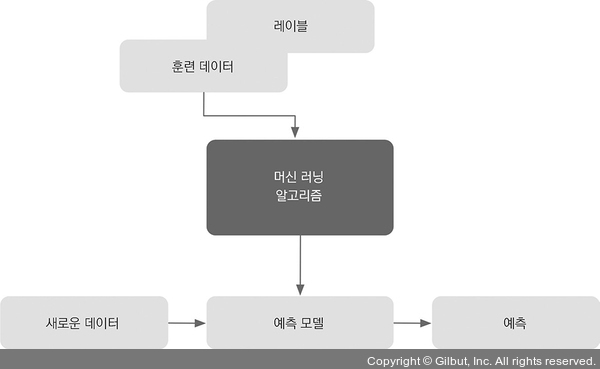
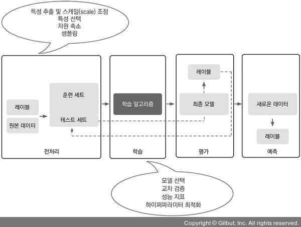

# AI-Learning
 ## 코드 오류 검사는 파이참을 이용하였고, 실행은 주피터 노트북을 이용하였습니다.
 ---
 ## Machine Learning

 - 주요 단어
   -  지도 학습(Supervised Learning)
      -  레이블된 데이터(정답이 확실한 데이터)
      -  직접 피드백
      -  출력 맻 미래 예측
   - 비지도 학습(Unsupervise Learning)
     - 레이블 및 타깃 없음
     - 피드백 없음
     - 데이터에서 숨겨진 구조 찾기
   - 강화 학습(Reinforcement Learnig)
     - 결정 과정
     - 보상 시스템
     - 여속된 행동에서 학습

----

  ### 지도 학습
- 희망하는 출력 레이블(신호)가 있는 일련의 샘필 즉, 예측 성공한 학습 형태


    
위 그림에서 새로운 데이터는 레이블 즉 정답이 없는 데이터를 예측 모델에 입력하여 예측하고 원하는 값이 나올경우 레이블이라고 볼 수 있다.

 - 분류(개별 클래스 레이블이 있는 지도 학습)
   - 이진 분류 = 결정경계로 음성 클래스와 양성 클래스로 구분 가능한 데이터 값들의 분류 방법
     - 다중 분류 = 순서가 없는 범주나 클래스 레이블로 표현되는 데이터 값들의 분류 방법
 - 회귀(연속적인 값을 출력하는 방법)
     - 회귀 예측
       - 연속적인 출력 값을 예측하는 분석 방법
       - 예측변수(특성)와 연속적인 반응 변수(타깃) 사이의 출력값을 예측하는 방법
 - 선형 회귀
   - 특성 x와 타깃 y가 주어진 경우 데이터 포인트와 직선 사이의 최소 거리의 직선을 이용하여 새로운 데이터 출력 값을 예측하는 방법
----
### 강화 학습
- 환경과 상호 작용하여 시스템 성능을 향상시키는 것을 목적으로 둔다.
  - 결과 값이 데이터의 레이블 값이 아닌 보상 함수로 통한 얼마나 행동이 좋은지 측정하는 값
  - ex) 체스 게임
  
(출처: https://www.secmem.org/blog/2020/02/08/snake-dqn/)

    위 그림에서 환경은 소프트웨어의 시뮬레이션, 에이전트는 모델의 관계를 나타낸 것이다.
    
    => 행동을 수행하고 즉시 얻거나 지연된 피드백을 통하여 얻은 전체 보상을 최대화 하는 학습 행동이다.

----

### 비지도 학습
 - 레이블되지 않거나 구조를 알 수 없는 데이터를 다루는 학습 방법
   - 군집(사전 정보 없이 쌓여 있는 그룹 정보를 의미 있는 서브그룸 또는 클러스터로 조직하는 탐색적 데이터 분석 기법)
   - 각 클러스터는 서로 유사성을 공유하고 다른 클러스터와 비슷하지 않은 샘플 그룹을 형성한다.
   - 비지도 분류라고 불리기도 한다.
   - 클러스터링 = 정보를 조직화하고 데이터에서 의미 있는 관계를 유도하는 도구
 - 차원 축소: 데이터 압축
   -  쉽게 말하면 많은 특성 => 적은 특성으로 압축하는 방법
   -  잡음 데이터를 제거하기 위해 특성 전처리 단계에서 종종 적용하는 방법

----
용어 정리
 - 훈련 샘플: 데이터셋을 나타내는 테이블의 행
 - 훈련: 특성과 샘플들을 알고리즘에 돌리는 행위
 - 특성(x): 데이터 테이블이나 데이터 행렬의 열
 - 타깃(y): 특성에 따른 출력, 레이블
 - 손실 함수: 전체 데이터셋에 대해 계산한 손실 즉, 정확도를 나타내는 척도이다.

----

- 머신 러닝의 작업 흐름도


- 전처리: 데이터 형태 갖추기
  - 머신 러닝 알고리즘에서 최적의 성능을 내리기 위해서는 선택된 특성이 같은 스케일을 가져야한다.
  - 만일 선택된 특성이 상관관계가 심할 경우 차원 축소 기법을 사용하여 압축한다, 이는 저장 공간이 덜 필요하고 학습 알고리즘을 더 빨리 실행 시킬 수 있다.
  - 신호 대 잡음비가 높은 경우 차원 축소 기법을 통해 예측 성능을 높이기도 한다.

----

## 퍼셉트론 API

- 인공 뉴런
  - 두 클래스가 있는 이진 분류 작업
    - 1(양성 클래스)
    - -1(음성 클래스)
  - 입력 값 x와 가중치 벡터 w의 선형 조합으로 결정 함수 ?(z)를 정의한다.
  - 따라서 z = 가중치 벡터 w 와 입력 값 x의 곱을 처음부터 m까지의 합으로 나타난다.
  - 임계 값(θ)를 지정하고 결정 함수 ?(z)가 임계 값보다 크거나 같을 경우 양성 클래스로 작을 경우 음성 클래스로 지정한다.
  - 퍼셉트론 알고리즘에서 결정 함수 ?(z)는 단위  계단 함수를 변형한 것이다.
  - 위 식을 간단하게 만들기 위해서 가중치 벡터의 첫번째를 -θ, 첫번째 입력 값을 0으로 정의하고 가중치 벡터를 행 벡터로 변환하여 계산하면 결국 결정 함수가 0보다 크거나 같을경우 양성 클래스 작을 경우 음성 클래스로 정의됩니다.

  - 퍼셉트론 알고리즘에서 입력 값 x는 자료에 의한 정보이고 가중치 벡터 w에 따라 결과 값의 정확성이 나눠지기 때문에 가중치 벡터 w를 잘 구하는 것이 알고리즘의 정확성에 직접적인 영향을 준다.
    - 가중치 벡터 w를 즉 기준점을 잘 잡기 위해서는 다음과 같은 학습 규칙을 따르는 것이 좋다.
    - 학습 규칙: q = n(y - y')x 
    - q: 개별 가중치 벡터의 변화량
    - n: 학습률(0.0 ~ 1.0사이 실수)
    - y: 특정 번호에 있는 진짜 클래스 레이블
    - y': 예측 클래스 레이블
    - 위 식을 따르면 정확한 예측이 이뤄진 경우 가중치가 변경되지 않고 그대로 유지된다 즉 업데이트 값은 0이 된다.
  
   - 첫 번째 그래프는 예측 성공하여 선형 결정 경계로 잘 나눠진 데이터셋을 보여주고 나머지 그래프는 그렇지 못한 그래프를 보여주고 있다, 오른쪽 두개의 그래프와 같은 알고리즘에서 훈련 데이터셋의 반복 최대 횟수를 지정하지 않을 경우 퍼셉트론 알고리즘에서는 업데이트 가중치는 멈추지 않는다.
  
  - 퍼셉트론 알고리즘의 이론상 작동 그림을 보여주고 있다.
  
  - 퍼셉트로 알고리즘
  ```Python
  import numpy as np
  # numpy: C언어로 구현된 파이썬 라이브러리로 벡터 및 행렬 연산시 유용하게 사용된다.
  class Perceptron(object):

    def __init__(self, eta=0.01, n_iter=50, random_state=1):
        self.eta = eta
        self.n_iter = n_iter
        self.random_state = random_state
  # def: 클래스 내부 함수인 메서드 정의
  # self: 객체의 인스턴스 그자체, 자기 자신을 참조하는 매개변수
    def fit(self, X, y):
    # 훈련 데이터 학습 매서드
        rgen = np.randem.RandomState(self.random_state)
        # 난수발생기로 난수를 random-state로 초기화 시킨다
        self.w_ + rgen.normal(loc=0.0, scale=0.01,
                              size=1 + X.shape[1])
                              #X.shape[1]: 절편의 값이 있기 때문에 크기를 1만큼 증가한다
        self.errors_ = [ ]
        # errors 리스트 생성
        for _ in range(self.n_iter):
            errors = 0
            for xi, target in zip(X, y):
            # zip 함수: x와y의 값을 하나씩 xi, target에 저장한다  
                update = self.eta * (target - self.predict(xi))
                # self.predict(xi): 예측 가중치 설정
                self.w_[1:] += update * xi
                # 가중치 1부터는 변화
                self.w_[0] += update
                # x의 첫번째 입력값은 1
                errors += int(update != 0.0)
                # 업데이트 값이 0.0이 아닐 경우 즉 타깃 정확도가 떨어질 경우
            self.errors_.append(errors)
            # append 함수를 이용하여 리스트에 요소를 추가한다
        return self

    def net_input(self, X):
      # 입력 계산
        return np.dot(X, self.w_[1:]) + self.w_[0]

    def predict(self, X):
      # 단위 계단 함수를 사용하여 클래스 레이블을 반환한다
        return np.where(self.net_input(X) >= 0.0, 1, -1)
  ```
  ```Python
  v1 = np.array([1, 2, 3])
  v2 = 0.5 * v1
  np.arccos(v1.dot(v2) / (np.linalg.norm(v1) * np.linalg.norm(v2)))
  # np.arccos: 역코사인 삼각 함수
  # np.linalg.norm: 벡터 길이를 계산하는 함수
  ```
  퍼셉트론 알고리즘을 입력한 후 위 알고리즘을 실행하면 업데이트 값이 0이 출력되는 것을 볼 수 있다, 이는 즉 정확하다는 의미입니다.

  ```Python
  import os
  import pandas as pd
  #pandas: 데이터분석을 위한 파이썬 라이브러리
  s = 'https://archive.ics.uci.edu/ml/machine-learning-databases/iris/iris.data'
  print('URL:', s)
  df = pd.read_csv(s, header=None, encoding='utf-8')
  #pd.read_csv: 경로를 병합하여 새 경로를 생성한다
  df.tail()
  #tail(n): 많은 데이터를 밑에서부터 n개 만큼 잘라서 출력한다, 만약 ()의 입력이 없을 경우 5로 자동 입력된다.
  ```
  위 코드의 출력 결과는 다음과 같다.

  

   - 위 그림에서 0,1,2,3은 특성을 나타낸다.
   - 위 그림에서 4는 타깃값을 나타낸다.

```Python
import matplotlib.pyplot as plt
# 차트나 플롯을 그리기 위한 라이브러리 패키지
import numpy as np

y = df.iloc[0:100, 4].values
#df.iloc[n:m, x]: 리스트의 n행과 m열 중에서 x개의 데이터를 추룰하는 함수
y = np.where(y == 'Iris-setosa', -1, 1)
#np.where: numpy 라이브러리의 함수로 Iris-setosa일 경우 -1 그 외의 경우 1로 간주한다

X = df.iloc[0:100, [0, 2]].values

plt.scatter(X[:50, 0], X[:50, 1],
            color='red', marker='o', label='setosa')
plt.scatter(X[50:100, 0], X[50:100, 1],
            color='blue', marker='x', label='versicolor')
#plt.scatter: setosa와 versicolor을 구분하여 범위를 지정한다.

plt.xlabel('sepal length [cm]')
plt.ylabel('petal length [cm]')
plt.legend(loc='upper left')

# plt.savefig('images/02_06.png', dpi=300)
plt.show()
```

위 코드의 출력 결과는 다음과 같다.


- 붓꽃 데이터셋 150개 중 100개를 추출한 데이터셋의 산점도를 그린것이다, 위 그림을 보면 선형 결정 경계로 두 데이터셋을 나눌수 있다는 것을 볼 수 있다.

